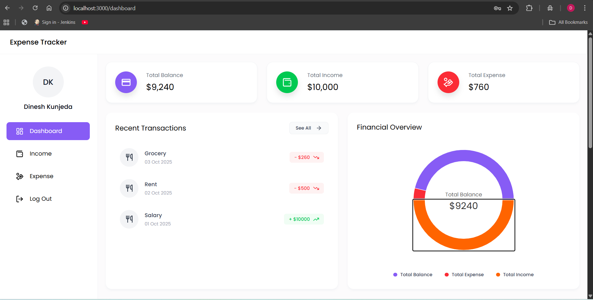
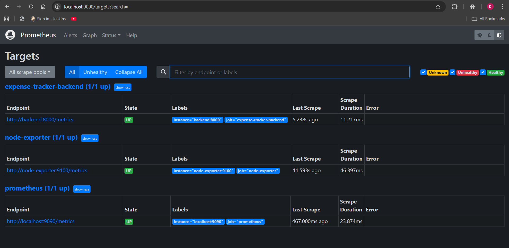
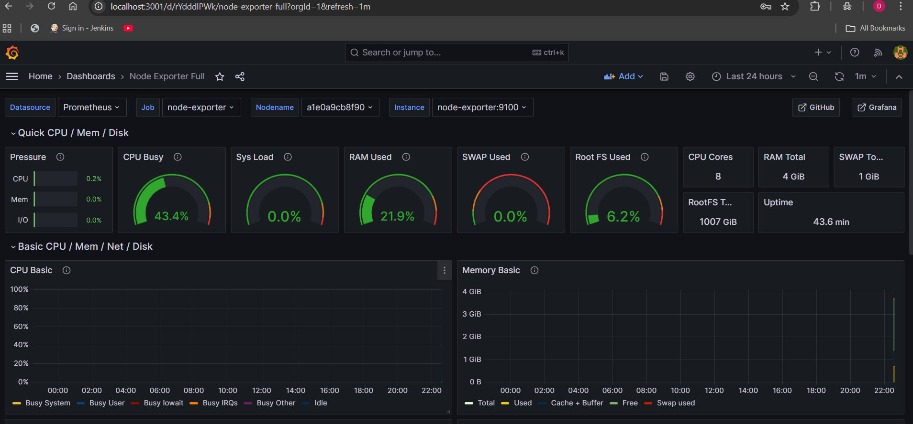

💰 Expense Tracker - DevOps Monitoring Project

Full-stack expense tracking app with integrated monitoring using Docker Compose, Prometheus & Grafana.

🏗️ Overview

A production-ready Expense Tracker with end-to-end monitoring and observability.
This project demonstrates real-world DevOps practices — containerization, orchestration, metrics collection, and dashboard visualization.

🔹 Tech Stack
Category	Technologies
Frontend	React.js (Vite, Material-UI)
Backend	Node.js, Express.js
Database	MongoDB Atlas
DevOps	Docker, Docker Compose
Monitoring	Prometheus, Grafana, Node Exporter
Auth	JWT, bcrypt

📸 Screenshots

#### **🚀 Expense-Tracker Interface**

#### **📊 Prometheus Monitoring**

#### **📈 Grafana Dashboard**

⚙️ Quick Start
Prerequisites

Docker & Docker Compose installed

MongoDB Atlas connection string

4 GB RAM recommended

Setup & Run
git clone https://github.com/yourusername/expense-tracker-devops.git
cd expense-tracker-devops
cp .env.example .env
# update MongoDB URI in .env

docker-compose up --build -d

Access Services
Service	URL	Description
🌐 Frontend	http://localhost:3000
	React app
🔧 Backend	http://localhost:8000
	REST APIs
❤️ Health Check	http://localhost:8000/health
	App status
📊 Prometheus	http://localhost:9090
	Metrics
📈 Grafana	http://localhost:3001
	Dashboards (admin/admin123)
📈 Monitoring Highlights

Custom Prometheus metrics at /metrics endpoint

Health check at /health for container orchestration

Node Exporter for system resource tracking

Grafana Dashboards for real-time visualization

Metrics include:

API response latency

Database connection health

Request/transaction rates

Memory & CPU usage

🐳 Docker Compose Architecture
services:
  frontend:
    build: ./frontend/expense-tracker
    ports: ["3000:80"]
    depends_on: [backend]

  backend:
    build: ./backend
    ports: ["8000:8000"]
    environment:
      - MONGO_URI=${MONGO_URI}
      - JWT_SECRET=${JWT_SECRET}
    healthcheck:
      test: ["CMD", "curl", "-f", "http://localhost:8000/health"]
      interval: 30s
      retries: 3

  prometheus:
    image: prom/prometheus
    ports: ["9090:9090"]
    volumes: ["./prometheus.yml:/etc/prometheus/prometheus.yml"]

  grafana:
    image: grafana/grafana
    ports: ["3001:3000"]
    environment:
      - GF_SECURITY_ADMIN_PASSWORD=admin123
    volumes: ["grafana-storage:/var/lib/grafana"]

  node-exporter:
    image: prom/node-exporter
    ports: ["9100:9100"]

🚀 Key DevOps Features

🐳 Dockerized multi-service stack (frontend + backend + monitoring)

📊 Prometheus & Grafana integration

🧠 Custom metrics & health endpoints

🔒 JWT authentication & secure config management

⚡ Production-grade observability setup

👨‍💻 Author

Dinesh Kunjeda

💻 GitHub:https://github.com/iamdk-16
